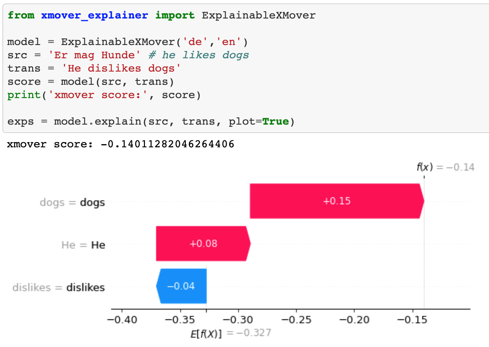

# Explainable NLG Metrics

This project aims at *explaining* state-of-the-art NLG metrics, including
* Monolingual metrics, in particular [BertScore](https://openreview.net/forum?id=SkeHuCVFDr) and [SBERT](https://github.com/UKPLab/sentence-transformers); and
* Crosslingual metrics, in particular [XMoverScore](https://github.com/AIPHES/ACL20-Reference-Free-MT-Evaluation).

We provide explanations by *breaking down* the score to show the *contribution* of each word. The break down scores are computed using the [SHAP](https://github.com/slundberg/shap) method.  

The above example uses BertScore to measure the semantic similarity between sentences. It shows that the contribution of word *hates* is negative, suggesting that its appearance *harms* the similarity score.  

In the example above, the quality of a translation is measured by *XMoverScore*, by comparing the semantic similarity between the source and the translation (without using any references). The score breakdown suggests that word *dislikes* harms the score. 

More monolingual examples can be found at [here](sts_example.ipynb), and crosslingual examples can be found at [here](xmover_example.ipynb)

**Contact person**: [Yang Gao](https://sites.google.com/site/yanggaoalex/home)@Royal Holloway, Unversity of London. Don't hesitate to drop me an e-mail if something is broken or if you have any questions. 

## License
Apache License Version 2.0
